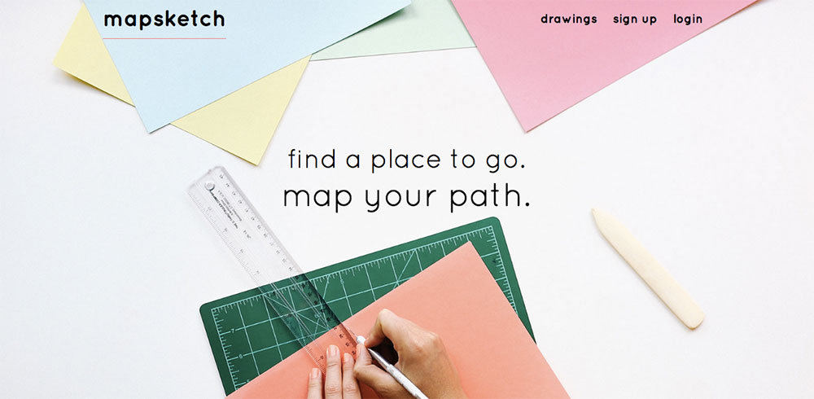
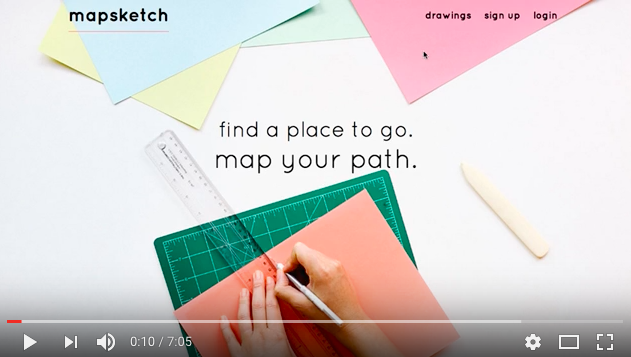
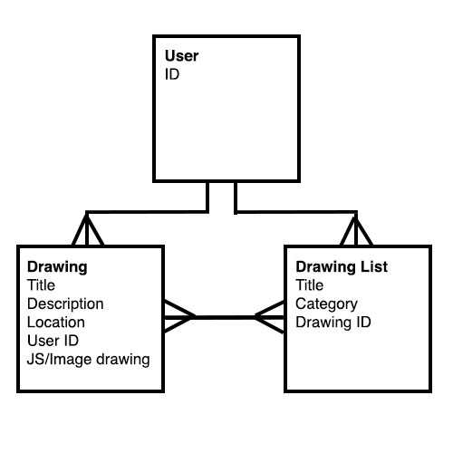

# Map Sketch

## Overview

MapSketch is a web app built on Ruby on Rails. The drawing functionality is made possible with JavaScript.

[View the Deployed App](https://mapsketch.herokuapp.com/)

## Technologies Used

- [Google Static Image Map API](https://developers.google.com/maps/documentation/static-maps/): for the HTML5 canvas background image
- [jscolor](http://jscolor.com/): for the color picker
- [Devise](https://github.com/plataformatec/devise): for user authentication
- HTML5 Canvas & JavaScript: for the functionality of drawing on a map
- Base64: encoding/decoding images as strings to store in a database
- [Heroku](http://www.heroku.com/): hosting the deployed app
- [Icons8](https://icons8.com/): Icons used for the sketching app

## Approach

I knew that I wanted to make some sort of drawing app after previously working with HTML5 canvas for a Hangman app, but the question was, what kind of drawing app? I also knew that I wanted to work with an API and mapping. So why not merge that all together?

I started off putting the skeleton in place for the CRUD functionality. Once I had that working, I tackled the drawing functionality with JavaScript. Although it would have been interesting to figure out how to code a color picker from scratch, I decided to use someone else's code for that feature.

For the images, I first used CarrierWave and AWS so users would have to right-click and save their map drawings and then upload them into the application. This seemed like a clunky solution, so I really wanted to figure out how to send the drawing to the database on form submit. The solution was encoding/decoding the canvas element with base64.

## Demo

## Planning

### User Stories

- As a user, I can draw on a map digitally.
- As a user, I can add new drawings.
- As a user, I can update previous drawing information I've added.

[View more User Stories](planning/user_stories.md)

## Installation

The app requires a Google API key if you wish to fork it and work on your own version.

## Unsolved Problems/Next Steps

- Email authentication for users who sign up by using ActionMailer
- Make it mobile-friendly
- Having drawing functionality work across devices
- Adding the 'get address' ability to the form so users can dynamically change the location for what map they draw on
- Ability to increase/decrease the zoom of the map

### And lastly, a major "nice to have..."

- Somehow storing the drawing coordinates so when users edit a map, they can edit the last drawing made on a specific map
