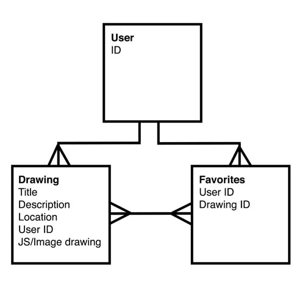

# Map Sketch

## Overview
MapSketch is a web app built on Ruby on Rails. The drawing functionality is made possible with JavaScript.

## Planning

### User Stories
* As a user, I can draw on a map digitally.
* As a user, I can add new drawings.
* As a user, I can update previous drawings I've added.
* As a user, I can delete drawings I no longer want to see in my account.

## Technologies Used
* [jscolor](http://jscolor.com/): for the colorpicker

